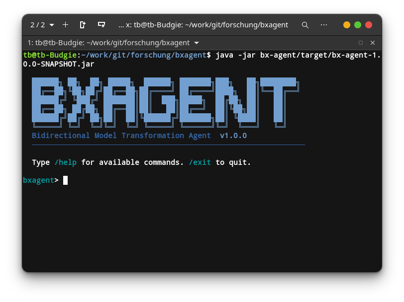

# BXAgent

[](https://github.com/tbuchmann/bx-agent/actions/workflows/maven.yml)
[](LICENSE)
[](https://openjdk.org/projects/jdk/21/)
[](https://maven.apache.org/)

BXAgent is a Java command-line tool for generating bidirectional, incremental EMF model transformations from two `.ecore` metamodels and an optional natural-language description. It uses an LLM to extract transformation mappings and generates Java transformation code and a test skeleton.



## Features

- LLM-supported mapping extraction from pairs of Ecore metamodels
- Forward and backward transformation generation
- Batch and incremental transformation support with a correspondence model
- Fingerprint-based matching for propagating model changes
- Synchronization of independently modified source and target models, with conflict and deletion policies
- Mapping constructs for role-based and conditional mappings, edge materialization, aggregation, and structural deduplication
- Interactive resolution of unresolved backward mappings
- Optional generated-code compilation validation and LLM-assisted repair
- Ollama, Anthropic, and OpenAI providers
- Interactive REPL with command completion and history
- Optional Maven/Eclipse project scaffolding and BenchmarX adapter generation

## Requirements

- Java 21 or later
- Maven 3.6 or later
- Ollama running locally, or an API key for Anthropic/OpenAI, if you want BXAgent to request mappings from an LLM

## Build

Build the multi-module project from its root:

```bash
mvn clean package
```

The modules are `bx-runtime` (the runtime library used by generated transformations) and `bx-agent` (the CLI). The current Maven build uses the Shade Plugin to create the executable, dependency-inclusive JAR:

```text
bx-agent/target/bx-agent-1.0.0-SNAPSHOT.jar
```

## Configure an LLM provider

The CLI expects `config/agent.properties` by default. Copy the example and edit it for your provider:

```bash
cp config/agent.properties.example config/agent.properties
```

For example, configure Ollama:

```properties
llm.provider=ollama
llm.model=devstral-small-2:latest
llm.base_url=http://localhost:11434
llm.temperature=0.2
llm.max_tokens=4096
llm.timeout=60
```

The supported provider names are `ollama`, `anthropic`, and `openai`. For Anthropic or OpenAI, set `llm.api_key` in the configuration file or set the `EMT_LLM_API_KEY` environment variable. Do not commit API keys.

## Generate a transformation

Run the CLI from the repository root. For example:

```bash
java -jar bx-agent/target/bx-agent-1.0.0-SNAPSHOT.jar \
  --source examples/pdb/PersonsDB1.ecore \
  --target examples/pdb/PersonsDB2.ecore \
  --output-dir generated \
  --description "Combine firstName and lastName into name; split name in the backward direction"
```

This writes the generated transformation class and test skeleton to `generated/`. By default, the generated Java package is `dev.bxagent.generated`; the output directory defaults to `./generated`.

To reuse an existing mapping response instead of asking the LLM to extract a new one, pass `--from-json path/to/mapping-llm-response.json`. The CLI still loads its configuration file. Interactive resolution of ambiguous backward mappings is enabled by default; use `--no-interactive` to disable it. Generated-code validation is off by default; use `--validate` to enable it.

### CLI options

| Option | Description | Default |
|---|---|---|
| `-s`, `--source` | Source `.ecore` metamodel (required) | — |
| `-t`, `--target` | Target `.ecore` metamodel (required) | — |
| `-o`, `--output-dir` | Directory for generated Java files | `./generated` |
| `-c`, `--config` | Path to `agent.properties` | `config/agent.properties` |
| `-d`, `--description` | Natural-language transformation description | — |
| `-e`, `--exclude-attr` | Attribute(s) to exclude from mapping and fingerprinting; repeatable | — |
| `--from-json` | Load a cached mapping response instead of calling the LLM | — |
| `--interactive`, `--no-interactive` | Enable or disable interactive backward-mapping prompts | `true` |
| `--validate`, `--no-validate` | Compile-check generated code and attempt LLM-assisted repair | `false` |
| `--debug-log`, `--no-debug-log` | Write LLM prompts and raw response to `llm-debug.log` | `false` |
| `--base-package` | Package for generated Java classes | `dev.bxagent.generated` |
| `--project-dir` | Also scaffold a standalone Maven/Eclipse project at this path | — |
| `--project-name` | Eclipse project name | Derived from metamodel names |
| `--group-id`, `--artifact-id` | Maven coordinates for the scaffolded project | Derived from project name |
| `--source-metamodel-dep`, `--target-metamodel-dep` | Metamodel Maven dependency in `groupId:artifactId:version` form | — |
| `--benchmarx-path` | BenchmarX project root; enables adapter generation | — |
| `--adapter-package` | Package for the generated BenchmarX adapter | `<base-package>.implementations.bxagent` |
| `-h`, `--help` | Show help | — |
| `-V`, `--version` | Show version | — |

## Interactive REPL

Starting BXAgent with no arguments opens the REPL:

```bash
java -jar bx-agent/target/bx-agent-1.0.0-SNAPSHOT.jar
```

Use `/help` to see commands. A typical session sets the metamodels and description, creates or loads a mapping plan, then generates code:

```text
/source examples/pdb/PersonsDB1.ecore
/target examples/pdb/PersonsDB2.ecore
/description Combine firstName and lastName into name
/plan
/build
/show code
```

The REPL also supports loading a cached plan with `/plan --from <file>`, inspecting session state, integrating generated files, running tests, and scaffolding Maven/Eclipse projects.

## Synchronize existing models

The `sync` subcommand synchronizes source and target `.xmi` models using an already generated transformation class and correspondence model:

```bash
java -jar bx-agent/target/bx-agent-1.0.0-SNAPSHOT.jar sync \
  --src families.xmi \
  --tgt persons.xmi \
  --transformation-class dev.bxagent.generated.Families2PersonsTransformation \
  --conflict-policy SOURCE_WINS \
  --deletion-policy CASCADE
```

If `--corr` is omitted, BXAgent derives the correspondence-model path from the source and target filenames. Available conflict policies are `SOURCE_WINS` (default), `TARGET_WINS`, and `LOG_AND_SKIP`. Available deletion policies are `CASCADE` (default), `ORPHAN`, and `TOMBSTONE`. The generated transformation class must be available on the Java classpath.

## Transformation examples

The repository includes eight shell scripts that run example transformations. Run them from the repository root after building and configuring BXAgent:

| Script | Example |
|---|---|
| [`pdb.sh`](pdb.sh) | Persons database: combine and split person names |
| [`f2p.sh`](f2p.sh) | Families to Persons: map family members to role-specific people |
| [`s2os.sh`](s2os.sh) | Sets to OrderedSets: preserve values and establish list order |
| [`pn2pnw.sh`](pn2pnw.sh) | Petri nets: materialize connections as weighted edge objects |
| [`gantt2cpm.sh`](gantt2cpm.sh) | Gantt to CPM: map activities/dependencies and flag unresolved event handling |
| [`ecore2sql.sh`](ecore2sql.sh) | Ecore to SQL: use cached mappings for schema and table generation |
| [`bags2bags.sh`](bags2bags.sh) | Bags: aggregate repeated values into multiplicities |
| [`ast2dag.sh`](ast2dag.sh) | Expression AST to DAG: structurally deduplicate shared expressions |

For example:

```bash
bash ./pdb.sh
```

The scripts write generated files to `generated/`. `ecore2sql.sh` explicitly uses the checked-in cached mapping response, so it does not request mapping extraction from the LLM. The other scripts request mappings from the configured provider. Cached mapping response files are also included for the `bags2bags` and `ast2dag` examples; to use one, add `--from-json examples/<example>/mapping-llm-response.json` to its script command.

## Technology

- Java 21
- Maven multi-module build (`bx-agent` and `bx-runtime`)
- Picocli and JLine for the CLI and interactive terminal
- Eclipse EMF for Ecore and model handling
- LangChain4j for Ollama, Anthropic, and OpenAI integrations
- FreeMarker for transformation and project generation
- Jackson for JSON processing
- JUnit for tests
- Maven Shade Plugin for the executable CLI JAR

## License

BXAgent is licensed under the [Eclipse Public License 2.0](LICENSE).
